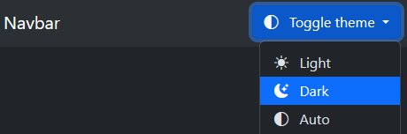

# bootstrap-dark-theme

Adds a [Bootstrap 5](https://getbootstrap.com/docs/5.3/) light/dark theme toggle button in the navbar using [Bootstrap color mode](https://getbootstrap.com/docs/5.3/customize/color-modes/)

## Installation

Install via `npm`:

```bash
npm install bootstrap-dark-theme@1
```

Use locally:

```html
<script src="./node_modules/bootstrap-dark-theme/dist/network.min.js"></script>
```

Use via CDN:

```html
<script src="https://cdn.jsdelivr.net/npm/bootstrap-dark-theme@1/dist/network.min.js"></script>
```

## Usage

Add this HTML navbar to your page. Modify as required.

```html
<!-- Include Bootstrap 5.3+ -->
<link href="https://cdn.jsdelivr.net/npm/bootstrap@5.3.6/dist/css/bootstrap.min.css" rel="stylesheet">

<nav class="navbar navbar-expand-lg bg-body-tertiary">
  <div class="container-fluid">
    <a class="navbar-brand" href="#">Navbar</a>

    <!-- Copy this dropdown anywhere in your page, e.g. inside a navbar -->
    <div class="position-relative" role="group" aria-label="Toggle dark mode" title="Toggle Dark Mode">
      <button class="dark-theme-toggle btn btn-primary dropdown-toggle" type="button" data-bs-toggle="dropdown" aria-expanded="false" aria-label="Open navigation menu">
        <svg xmlns="http://www.w3.org/2000/svg" width="16" height="16" fill="currentColor" class="bi bi-circle-half" viewBox="0 0 16 16">
          <path d="M8 15A7 7 0 1 0 8 1zm0 1A8 8 0 1 1 8 0a8 8 0 0 1 0 16" />
        </svg>
        <span class="d-lg-none ms-2">Toggle theme</span>
      </button>
      <ul class="dropdown-menu dropdown-menu-end">
        <li><button class="dropdown-item" data-bs-theme-value="light">
            <svg xmlns="http://www.w3.org/2000/svg" width="16" height="16" fill="currentColor" class="me-2 bi bi-sun-fill" viewBox="0 0 16 16">
              <path d="M8 12a4 4 0 1 0 0-8 4 4 0 0 0 0 8M8 0a.5.5 0 0 1 .5.5v2a.5.5 0 0 1-1 0v-2A.5.5 0 0 1 8 0m0 13a.5.5 0 0 1 .5.5v2a.5.5 0 0 1-1 0v-2A.5.5 0 0 1 8 13m8-5a.5.5 0 0 1-.5.5h-2a.5.5 0 0 1 0-1h2a.5.5 0 0 1 .5.5M3 8a.5.5 0 0 1-.5.5h-2a.5.5 0 0 1 0-1h2A.5.5 0 0 1 3 8m10.657-5.657a.5.5 0 0 1 0 .707l-1.414 1.415a.5.5 0 1 1-.707-.708l1.414-1.414a.5.5 0 0 1 .707 0m-9.193 9.193a.5.5 0 0 1 0 .707L3.05 13.657a.5.5 0 0 1-.707-.707l1.414-1.414a.5.5 0 0 1 .707 0m9.193 2.121a.5.5 0 0 1-.707 0l-1.414-1.414a.5.5 0 0 1 .707-.707l1.414 1.414a.5.5 0 0 1 0 .707M4.464 4.465a.5.5 0 0 1-.707 0L2.343 3.05a.5.5 0 1 1 .707-.707l1.414 1.414a.5.5 0 0 1 0 .708" />
            </svg>
            Light</button></li>
        <li><button class="dropdown-item" data-bs-theme-value="dark">
            <svg xmlns="http://www.w3.org/2000/svg" width="16" height="16" fill="currentColor" class="me-2 bi bi-moon-stars-fill" viewBox="0 0 16 16">
              <path d="M6 .278a.77.77 0 0 1 .08.858 7.2 7.2 0 0 0-.878 3.46c0 4.021 3.278 7.277 7.318 7.277q.792-.001 1.533-.16a.79.79 0 0 1 .81.316.73.73 0 0 1-.031.893A8.35 8.35 0 0 1 8.344 16C3.734 16 0 12.286 0 7.71 0 4.266 2.114 1.312 5.124.06A.75.75 0 0 1 6 .278" />
              <path d="M10.794 3.148a.217.217 0 0 1 .412 0l.387 1.162c.173.518.579.924 1.097 1.097l1.162.387a.217.217 0 0 1 0 .412l-1.162.387a1.73 1.73 0 0 0-1.097 1.097l-.387 1.162a.217.217 0 0 1-.412 0l-.387-1.162A1.73 1.73 0 0 0 9.31 6.593l-1.162-.387a.217.217 0 0 1 0-.412l1.162-.387a1.73 1.73 0 0 0 1.097-1.097zM13.863.099a.145.145 0 0 1 .274 0l.258.774c.115.346.386.617.732.732l.774.258a.145.145 0 0 1 0 .274l-.774.258a1.16 1.16 0 0 0-.732.732l-.258.774a.145.145 0 0 1-.274 0l-.258-.774a1.16 1.16 0 0 0-.732-.732l-.774-.258a.145.145 0 0 1 0-.274l.774-.258c.346-.115.617-.386.732-.732z" />
            </svg>
            Dark</button></li>
        <li><button class="dropdown-item" data-bs-theme-value="auto">
            <svg xmlns="http://www.w3.org/2000/svg" width="16" height="16" fill="currentColor" class="me-2 bi bi-circle-half" viewBox="0 0 16 16">
              <path d="M8 15A7 7 0 1 0 8 1zm0 1A8 8 0 1 1 8 0a8 8 0 0 1 0 16" />
            </svg>
            Auto</button></li>
      </ul>
    </div>

  </div>
</nav>

<script src="https://cdn.jsdelivr.net/npm/bootstrap@5.3.6/dist/js/bootstrap.bundle.min.js"></script>
<!-- This uses the .dark-theme-toggle class and the data-bs-theme-value= attribute to change color theme -->
<script src="https://cdn.jsdelivr.net/npm/bootstrap-dark-theme@1/dist/dark-theme.js" type="module"></script>
```


You will get an output like this:



# Setup

To run this project locally:

- Clone this repo, and run `npm install` to install dependencies
- Run `npm run build` to compile
- Open [`index.html`](index.html ":ignore") using a HTTP server (e.g. `python -m http.server`)

To release, run:

```shell
npm version minor
npm publish
git push --tags
```

# License

[MIT](LICENSE)
